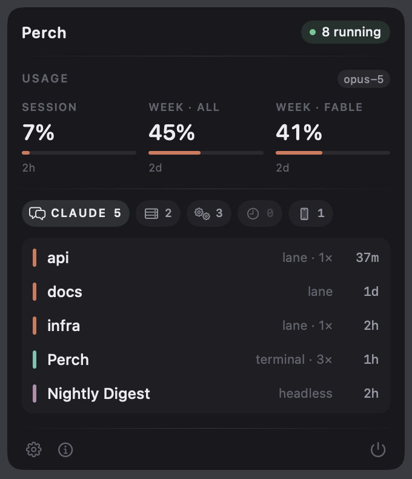
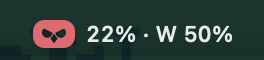
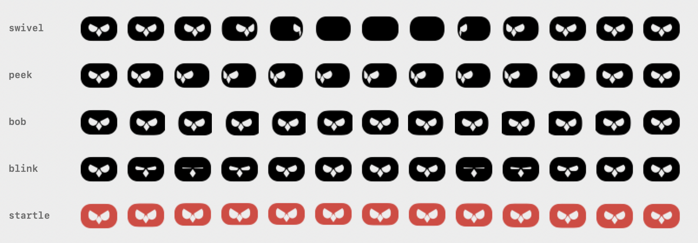

<h1 align="center">
  <br />
  Perch
</h1>

<p align="center">
An owl that lives in your menu bar and keeps an eye on everything running on your Mac:
Claude Code sessions, dev servers, background agents, cron jobs, simulators, and how much of your
Claude usage limit is left.
</p>

<p align="center">
  
  
  
</p>

<p align="center">
  
</p>

Everything above was four things before: a usage-ring app, a SwiftBar plugin, `ps | grep claude`,
and no answer at all for which agents were still running. Perch is one panel, one poll, one icon.

## What it watches

- **Claude Code sessions.** One row per session, not per process, grouped by kind and working
  directory. Remote-control lanes, interactive terminals, and headless `--print` runs are told
  apart and aged separately, because a lane idle for two days is normal and a headless run alive
  for seventeen hours is not.
- **Usage limits.** Session and weekly windows as percent-of-limit, with the time until each
  resets. The leading number rides in the menu bar next to the owl.
- **Dev servers.** Every listening port with its framework and project name, detected across
  Next.js, Vite, Nuxt, Remix, Astro, Django, Flask, Rails and more. Stop and relaunch in one
  click; when a restart doesn't come back, the row says why instead of going quiet.
- **Background agents and cron.** Every LaunchAgent in `~/Library/LaunchAgents` with its
  schedule and whether it is running, idle, or failed, plus active crontab lines. Read-only on
  purpose (see below).
- **Simulators.** Booted simulators with device, runtime, and the app running inside. Click one
  to focus its window.

Sections collapse, empty ones hide themselves, and it can start at login.

## The owl

<p align="center">
  
</p>

The glyph is not an image asset. A status item is a 22pt monochrome template, which rules out
Lottie, GIF and SVG alike, so the owl is a hand-drawn vector recomputed and re-rasterised sixty
times a second.

Mostly it does nothing. Every few seconds it picks one behaviour, plays it once, and goes back to
sitting still: usually a blink, sometimes a double one, sometimes a glance to one side and back.
Sometimes it does a slow sideways bob with the face held level, which is how a real owl gets
parallax out of eyes that cannot move in their sockets. About one time in seven it turns its head
the whole way round.

<p align="center">
  
</p>

Halfway through that turn you are looking at the back of its head, and the icon is a plain rounded
rectangle for about an eighth of a second. That blank frame is the reason the turn exists. Every
feature rides a vertical cylinder standing inside the head, so turning foreshortens the eyes and
carries the far one out of sight, which two circles sliding sideways can never do.

When nothing is running the eyes sit half shut. When something goes stale or fails the owl
startles, goes wide-eyed, and turns red, and it stays red until you deal with it. That is the only
motion in the app that means anything; the rest is a bird filling time.

Nothing loops. A menu bar item in constant motion reads as a twitch rather than as an animal, so
every behaviour ends back at rest.

The head is a wide squircle rather than a drawn silhouette. Every attempt at ear tufts, a brow
line or a tapered chin read as a cat at menu bar size. The owl comes from the features: sliced
glaring eyes and a beak inside a squat frame, which is also all that survives being flattened to
one colour.

## Install

No release build. Clone it and build with Xcode 15 or later:

```
git clone https://github.com/abhaymettu/perch.git
cd perch
xcodebuild -scheme Perch -configuration Release build
```

Or open `Perch.xcodeproj` and hit run. Requires macOS 14 (Sonoma) or later.

## Network and privacy

Perch makes one network request, and only if you use Claude Code:

- Every 180 seconds it `GET`s `https://api.anthropic.com/api/oauth/usage` to read your rate-limit
  percentages. Nothing is sent but the request itself.
- It authenticates with the OAuth token Claude Code already stores in your login Keychain, read
  per-request via `/usr/bin/security` and held only for the length of the request. The token is
  never written to disk, never logged, and never sent anywhere except Anthropic.
- If the token is missing or expired, the usage strip hides itself and nothing else changes.

Everything else, meaning processes, ports, agents and simulators, is read locally. No telemetry,
no analytics, no update check, no elevated permissions, no background daemon.

## Why the agents are read-only

Perch will show you a LaunchAgent's state but will not start, stop, or unload it. A menubar panel
is the wrong place for a control whose misfire takes down something you rely on and gives you no
way to bring it back. Reveal the plist and use `launchctl` if you mean it.

Claude sessions and dev servers *are* killable, because those are cheap to restart.

## How it works

Perch polls every few seconds using standard macOS tools:

- **Port scanning.** `lsof` to find listening TCP ports
- **Process classification.** `ps`, matching on `argv[0]` and the resolved binary, never a
  substring search over the full argument string
- **Project names.** Reads `package.json`, `Cargo.toml`, or falls back to the directory name
- **Agents and cron.** `launchctl list` cross-referenced against the plists on disk, and `crontab -l`
- **Simulators.** `xcrun simctl` for booted simulator data

That second bullet is load-bearing. `ps aux | grep claude` reports about 341 processes on a
machine running roughly 25, because it also matches the `.claude/shell-snapshots/` path inside
every unrelated shell. Matching the resolved executable instead of a substring of the argument
string is the difference between a useful list and noise.

Restarting is less obvious than it sounds. The process holding a port often can't be relaunched
from its own arguments, because Next.js and npm both overwrite their `argv` with a display title
and `argv[0]` is usually a bare name like `node` rather than a path. So Perch reads the real
arguments and the resolved binary from the kernel, and walks up the parent chain to find a process
that can actually be launched again, never straying outside the server's own project directory.

## Tech

- SwiftUI, in an `NSPanel` hung off an `NSStatusItem`
- Swift concurrency (async/await, `TaskGroup`)
- `@Observable` for reactive state
- `SMAppService` for start at login
- macOS 14+ (Sonoma)

Design work happens in a preview harness rather than the live panel, because the panel is
invisible to Accessibility and awkward to screenshot. Set `PERCH_UI_PREVIEW` and the app opens a
window rendering every UI state side by side. See `Perch/Design/PreviewHarness.swift`.

## Contributing

Issues and PRs welcome. Branch off `main`, keep the diff small, and say what it does.

## Credits

Perch started as a fork of [Blink](https://github.com/megootronic/Blink) by
[Mo](https://mo.software), which is where the dev server and simulator monitoring comes from.
Claude session tracking, usage limits, LaunchAgents, cron and the owl were added here.

## License

MIT. See [LICENSE](LICENSE); the original copyright is retained alongside this one.
